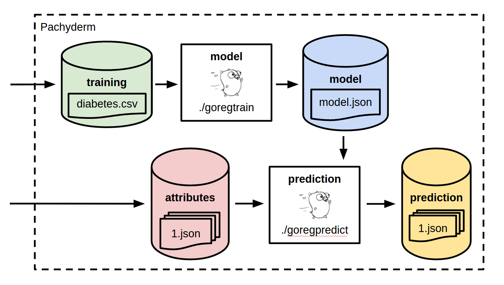

## Pachyderm Pipline for Go-based Linear Regression

This tutorial will walk you through the implementation of training and prediction with linear regression in a [Pachyderm](https://pachyderm.io/) pipeline. Pachyderm is a project, written in Go, for production scale ML/AI pipelining and data versioning on top of [Kubernetes](https://kubernetes.io/) (a container orchestrator also written in Go). In this example, we will train a linear regression model to predict diabetes disease progression based on various medical atributes or indicators.

## The pipeline

To deploy and manage the model discussed above, we will implement it’s training, model persistence, and prediction in a Pachyderm pipeline.  This will allow us to:

- Keep a rigorous historical record of exactly what models were used on what data to produce which results.
- Automatically update online ML models when training data or parameterization changes.
- Easily revert to other versions of an ML model when a new model is not performing or when “bad data” is introduced into a training data set.

The general structure of our pipeline will look like this:



The cylinders represent data “repositories” in which Pachyderm will version training, model, etc. data (think “git for data”).  These data repositories are then input/output of the linked data processing stages (represented by the boxes in the figure and running as pods in k8s).  

## Getting up and running with Pachyderm

You can experiment with this pipeline locally using a quick [local installation of Pachyderm](http://docs.pachyderm.io/en/latest/getting_started/local_installation.html).  Alternatively, you can quickly spin up a real Pachyderm cluster in any one of the popular cloud providers.  Check out the [Pachyderm docs](http://docs.pachyderm.io/en/latest/deployment/deploy_intro.html) for more details on deployment.

Once deployed, you will be able to use the Pachyderm’s `pachctl` CLI tool to create data repositories, create pipelines, and analyze our results.

If you are using `minikube` locally (recommended), the setup of Pachyderm should look like:

```
$ minikube start
😄  minikube v1.2.0 on darwin (amd64)
🔥  Creating virtualbox VM (CPUs=2, Memory=2048MB, Disk=20000MB) ...
🐳  Configuring environment for Kubernetes v1.15.0 on Docker 18.09.6
🚜  Pulling images ...
🚀  Launching Kubernetes ...
⌛  Verifying: apiserver proxy etcd scheduler controller dns
🏄  Done! kubectl is now configured to use "minikube"

$ kubectl get all
NAME                 TYPE        CLUSTER-IP   EXTERNAL-IP   PORT(S)   AGE
service/kubernetes   ClusterIP   10.96.0.1    <none>        443/TCP   5m12s

$ pachctl deploy local --no-dashboard
serviceaccount/pachyderm created
clusterrole.rbac.authorization.k8s.io/pachyderm created
clusterrolebinding.rbac.authorization.k8s.io/pachyderm created
deployment.apps/etcd created
service/etcd created
service/pachd created
deployment.apps/pachd created
secret/pachyderm-storage-secret created

Pachyderm is launching. Check its status with "kubectl get all"

$ kubectl get pods
NAME                     READY   STATUS    RESTARTS   AGE
etcd-7f485bd46b-dgnhb    1/1     Running   0          58s
pachd-74b88945cc-xrp54   1/1     Running   0          58s

$ pachctl version
COMPONENT           VERSION
pachctl             1.9.1
pachd               1.9.1
```


## Training/fitting the linear regression model

First, let’s look our training stage.  The [train-single](train-single) and [train-multi](train-multi) go programs (and corresponding Docker images) allow us to train a single linear regression model and a multiple linear regression model, respectively, using github.com/sajari/regression.  The single linear regression model will predict diabetes disease progression based on a single attribute `bmi` (body mass index), and the multiple linear regression model will predict diabetes disease progression based on two attributes, `bmi` and `ltg` (a blood related measurement).

The data that we will use to train the model is freely available (e.g., [here](https://archive.ics.uci.edu/ml/datasets/Diabetes)) in CSV format:  

```
age,sex,bmi,map,tc,ldl,hdl,tch,ltg,glu,y
0.0380759064334,0.0506801187398,0.0616962065187,0.021872354995,-0.0442234984244,-0.0348207628377,-0.043400845652,-0.00259226199818,0.0199084208763,-0.0176461251598,151.0
-0.00188201652779,-0.044641636507,-0.0514740612388,-0.0263278347174,-0.00844872411122,-0.0191633397482,0.0744115640788,-0.0394933828741,-0.0683297436244,-0.0922040496268,75.0
0.0852989062967,0.0506801187398,0.0444512133366,-0.00567061055493,-0.0455994512826,-0.0341944659141,-0.0323559322398,-0.00259226199818,0.00286377051894,-0.0259303389895,141.0
-0.0890629393523,-0.044641636507,-0.0115950145052,-0.0366564467986,0.0121905687618,0.0249905933641,-0.0360375700439,0.0343088588777,0.0226920225667,-0.00936191133014,206.0
0.00538306037425,-0.044641636507,-0.0363846922045,0.021872354995,0.00393485161259,0.0155961395104,0.00814208360519,-0.00259226199818,-0.0319914449414,-0.0466408735636,135.0
-0.0926954778033,-0.044641636507,-0.0406959405,-0.0194420933299,-0.0689906498721,-0.0792878444118,0.041276823842,-0.07639450375,-0.041180385188,-0.0963461565417,97.0
etc...
```

The [train-single](train-single) and [train-multi](train-multi) go programs take this CSV dataset as input and output representations of the trained/fit models in a JSON format that looks like:

```
{
    "intercept": 152.13348416289583,
    "coefficients": [
        {
            "name": "bmi",
            "coefficient": 675.069774431606
        },
        {
            "name": "ltg",
            "coefficient": 614.9505047824742
        }
    ]
}
```

## Making predictions with the linear regression model.

The [predict](predict) go program (and corresponding Docker image) allows us to predict diabetes disease progression based on a saved JSON representation of our model (see above).  `goregpredict` takes that JSON model representation as input along with one or more JSON files, each listing particular attributes:

```
{
	"independent_variables": [
		{
			"name": "bmi",
			"value": 0.0616962065187
		},
		{
			"name": "ltg",
			"value": 0.0199084208763
		}
	]
}
```

`goregpredict` then outputs a prediction based on these attributes:

```
{
    "predicted_diabetes_progression": 210.7100380636843,
    "independent_variables": [
        {
            "name": "bmi",
            "value": 0.0616962065187
        },
        {
            "name": "ltg",
            "value": 0.0199084208763
        }
    ]
}
```

## Putting it all together, running the pipeline

First let's create Pachyderm "data repositories" in which we will version our training dataset and our attributes (from which we will make predictions):

```
$ pachctl create repo training

$ pachctl create repo attributes

$ pachctl list repo
NAME       CREATED        SIZE (MASTER)
attributes 7 seconds ago  0B
training   14 seconds ago 0B                 
```

Next we put our training data set in the `training` repo:

```
$ cd data

$ pachctl put file training@master:diabetes.csv -f diabetes.csv 

$ pachctl list repo
NAME       CREATED       SIZE (MASTER)
attributes 2 minutes ago 0B
training   2 minutes ago 73.74KiB

$ pachctl list file training@master
NAME          TYPE SIZE
/diabetes.csv file 73.74KiB
```

We can then create our training and prediction pipelines based on JSON specifications ([train.json](train.json) and [predict.json](predict.json)) specifying the Docker images to run for each processing stage, the input to each processing stage, and commands to run in the Docker images.  You could use either the single (`dwhitena/goregtrain:single`) or multiple (`dwhitena/goregtrain:mutli`) regression models in [train.json](train.json). This will automatically trigger the training of our model and output of the JSON model representation, because Pachyderm sees that there is training data in `training` that has yet to be processed:

```
$ cd ..

$ pachctl create pipeline -f train.json 

$ pachctl list job
ID                               PIPELINE STARTED        DURATION           RESTART PROGRESS  DL       UL   STATE
58a3e0027d3e42659e2c8bd15e1c5af5 model    22 seconds ago Less than a second 0       1 + 0 / 1 73.74KiB 160B success

$ pachctl list repo
NAME       CREATED            SIZE (MASTER)
model      About a minute ago 160B
attributes 6 minutes ago      0B
training   6 minutes ago      73.74KiB

$ pachctl list file model@master
NAME        TYPE SIZE
/model.json file 160B  

$ pachctl get file model@master:model.json
{
    "intercept": 152.13348416289818,
    "coefficients": [
        {
            "name": "bmi",
            "coefficient": 949.4352603839862
        }
    ]
}
```

Finally, we can create out prediction pipeline stage and commit some attribute files into `attributes` to trigger predictions:

```
$ pachctl create pipeline -f predict.json

$ cd data/test/

$ ls
1.json  2.json  3.json

$ pachctl put file attributes@master -r -f .

$ pachctl list job
ID                               PIPELINE   STARTED        DURATION           RESTART PROGRESS  DL       UL   STATE
043e16c78bec4f4b9435b68ec98e9b4f prediction 26 seconds ago Less than a second 0       3 + 0 / 3 914B     802B success
5949f82971ee4089a73627d8a2e41ad2 prediction 41 seconds ago Less than a second 0       0 + 0 / 0 0B       0B   success
58a3e0027d3e42659e2c8bd15e1c5af5 model      32 minutes ago Less than a second 0       1 + 0 / 1 73.74KiB 160B success

$ pachctl list repo
NAME       CREATED            SIZE (MASTER)
prediction About a minute ago 802B
attributes About a minute ago 434B
model      33 minutes ago     160B
training   38 minutes ago     73.74KiB   

$ pachctl list file prediction@master
NAME    TYPE SIZE
/1.json file 266B
/2.json file 268B
/3.json file 268B

$ pachctl get file prediction@master:1.json
{
    "predicted_diabetes_progression": 210.7100380636843,
    "independent_variables": [
        {
            "name": "bmi",
            "value": 0.0616962065187
        },
        {
            "name": "ltg",
            "value": 0.0199084208763
        }
    ]
}
```

## (Bonus) Managing, updating, and scaling the pipeline

You may not get to all of these bonus exercises during the workshop time, but you can perform these and all of the above steps any time you like with a [simple local Pachyderm install](http://docs.pachyderm.io/en/latest/getting_started/local_installation.html). 

### 1. Parallelize the inference

You may have noticed that our pipeline specs included a `parallelism_spec` field.  This tells Pachyderm how to parallelize a particular pipeline stage. Let's say that in production we start receiving a huge number of patient attributes (or we need to perform periodic batch updating of predictions). In particular, let's say we want to spin up 10 prediction workers to perform inference in parallel.

This actually doesn't require any change to our code.  We can simply change our `parallelism_spec` to:

```
  "parallelism_spec": {
    "constant": "10"
  },
```

and update the pipeline:

```
$ vim predict.json 
$ pachctl update pipeline -f predict.json 
```

Pachyderm will then spin up 10 inference workers, each running our same `infer` program, to perform inference in parallel.  This can be confirmed by examining the cluster pods:

```
$ kubectl get pods
NAME                           READY   STATUS            RESTARTS   AGE
etcd-7f485bd46b-dgnhb          1/1     Running           0          47m
pachd-74b88945cc-xrp54         1/1     Running           0          47m
pipeline-model-v1-4hgmj        2/2     Running           0          40m
pipeline-prediction-v2-chlnr   0/2     PodInitializing   0          4s
pipeline-prediction-v2-d6b9b   0/2     Init:0/1          0          4s
pipeline-prediction-v2-lcwm5   0/2     Init:0/1          0          4s
pipeline-prediction-v2-lz4sz   0/2     Pending           0          4s
pipeline-prediction-v2-nw9zs   0/2     Init:0/1          0          4s
pipeline-prediction-v2-qjz2k   0/2     Pending           0          4s
pipeline-prediction-v2-s7g5p   0/2     Pending           0          4s
pipeline-prediction-v2-txnvc   0/2     Pending           0          4s
pipeline-prediction-v2-vxrlp   0/2     Init:0/1          0          4s
pipeline-prediction-v2-zjv9f   0/2     Init:0/1          0          4s

$ kubectl get pods
NAME                           READY   STATUS    RESTARTS   AGE
etcd-7f485bd46b-dgnhb          1/1     Running   0          47m
pachd-74b88945cc-xrp54         1/1     Running   0          47m
pipeline-model-v1-4hgmj        2/2     Running   0          40m
pipeline-prediction-v2-chlnr   2/2     Running   0          9s
pipeline-prediction-v2-d6b9b   2/2     Running   0          9s
pipeline-prediction-v2-lcwm5   2/2     Running   0          9s
pipeline-prediction-v2-lz4sz   0/2     Pending   0          9s
pipeline-prediction-v2-nw9zs   2/2     Running   0          9s
pipeline-prediction-v2-qjz2k   0/2     Pending   0          9s
pipeline-prediction-v2-s7g5p   0/2     Pending   0          9s
pipeline-prediction-v2-txnvc   0/2     Pending   0          9s
pipeline-prediction-v2-vxrlp   2/2     Running   0          9s
pipeline-prediction-v2-zjv9f   2/2     Running   0          9s 
```

### 2. Update the training data set

Let's say that one or more observations in our training data set were corrupt or unwanted.  Thus, we want to update our training data set.  To simulate this, go ahead and open up `diabetes.csv` (e.g., with `vim`) and remove a couple of the observations (from the non-header rows).  Then, let's replace our training set:

```
$ vim diabetes.csv
$ pachctl put file training@master:diabetes.csv -f -o diabetes.csv
```

Immediately, Pachyderm "knows" that the data has been updated, and it starts a new job to update the modeling and QC. Not only that, when the new model has been produced and QC'ed, Pachyderm "knows" that there is a new model and updates the previously inferred disease predictions.
